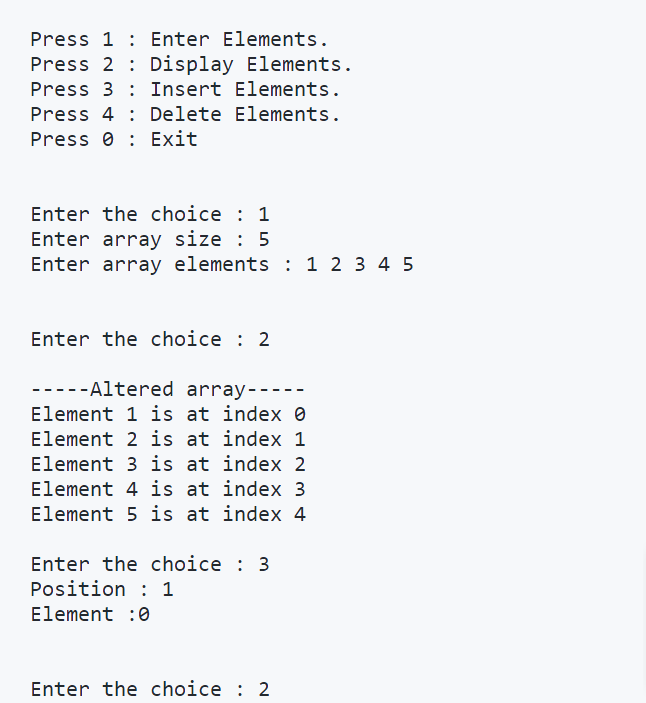
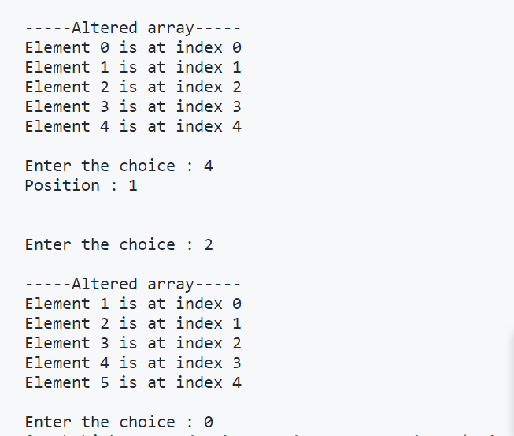

<!DOCTYPE>
<html>
    <head></head>
        <body>
            <h3>ARRAY OPERATIONS</h3>
            
<ul>
                <li>Inserting an Element at a given valid position.</li>
                <li>Deleting an Element at a given valid position.</li>
                <li>Display of Array Elements.</li>
            </ul>

            
            
            <h3>STACK OPERATIONS</h3>
        </body>
</html>
